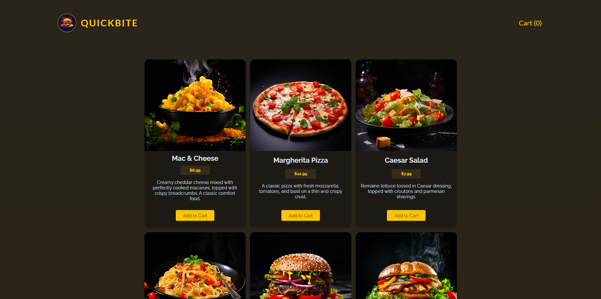
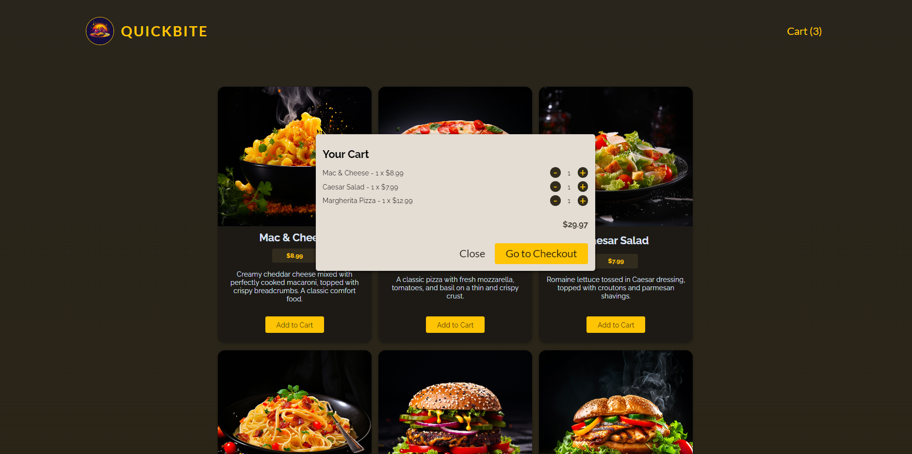
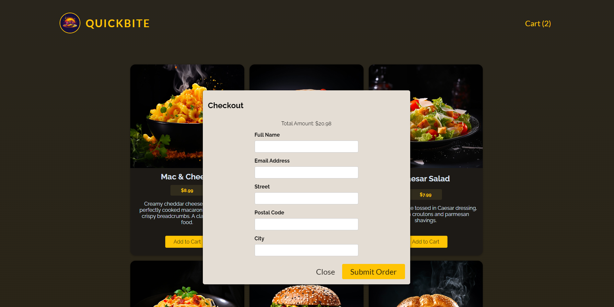
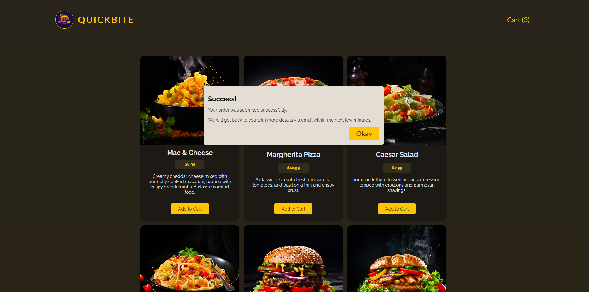

<div align="center">

# QuickBite

Explore the world of culinary delights with QuickBite - a convenient app for discovering and ordering delicious meals. Crafted with simplicity using Vite and React, QuickBite empowers you to effortlessly explore menus, place orders, and savor every bite. Simplify your dining experience and indulge in a variety of flavors with QuickBite.

</div>

---

## 🚀 Live Demo

**Live Preview** ➡️ [Demo](https://quick-bite-seven.vercel.app/)

---

## 🛠️ Installation Steps

Follow the steps below to set up the project:

1. **Clone the repository**

```
git clone https://github.com/AMaroto98/QuickBite.git
```

2. **Install dependencies**

```
cd QuickBite
npm install
```

3. **Start the server**

```
npm run dev
```

Once the server is up and running, you can access the QuickBite application in your web browser.

---

## 💻 Tech Stack


---

## 🖼️ Project Screenshots

Explore the QuickBite project with these captivating screenshots, highlighting its sleek and user-friendly interface.






---

<div align="center">
Made with ❤️ by AMaroto98.
</div>
